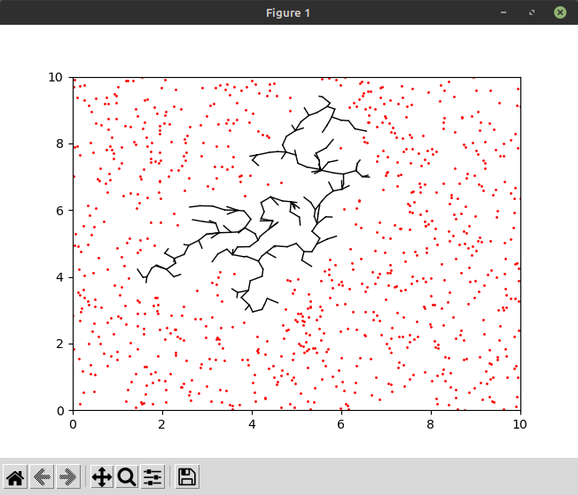

# Moved to Codeberg

This repository was moved to Codeberg:
https://codeberg.org/Kotbenek/diffusion-limited-aggregation

# diffusion-limited-aggregation

A simulation of **diffusion-limited aggregation** implemented in Python and C++.

## Usage

### Python prototype

This section applies to the prototype located in `python` directory.

Optionally, create a virtual environment and activate it:
```
$ python3 -m venv venv/
$ . venv/bin/activate
```

Install required packages:
```
$ pip3 install -r requirements.txt
```

Run the simulation:
```
$ python3 generate.py
```

While the simulation is running, its current status is displayed:


### C++ rewrite

To speed up the simulation, it was rewritten in C++. It can be found in `cpp` directory.

Compile and run the simulation:
```
$ ./build_and_run.sh
```

While the simulation is running, current active ion count is printed on each iteration. The result is stored as `tree_connections.txt`.

### C++ visualization

As C++ simulation provides its result in text form, a small Python script is provided for visualization. It is located in `cpp-visualization` directory.

Optionally, create a virtual environment and activate it:
```
$ python3 -m venv venv/
$ . venv/bin/activate
```

Install required packages:
```
$ pip3 install -r requirements.txt
```

Run the visualization:
```
$ python3 visualize.py
```

The result is stored as `fig.png`.
